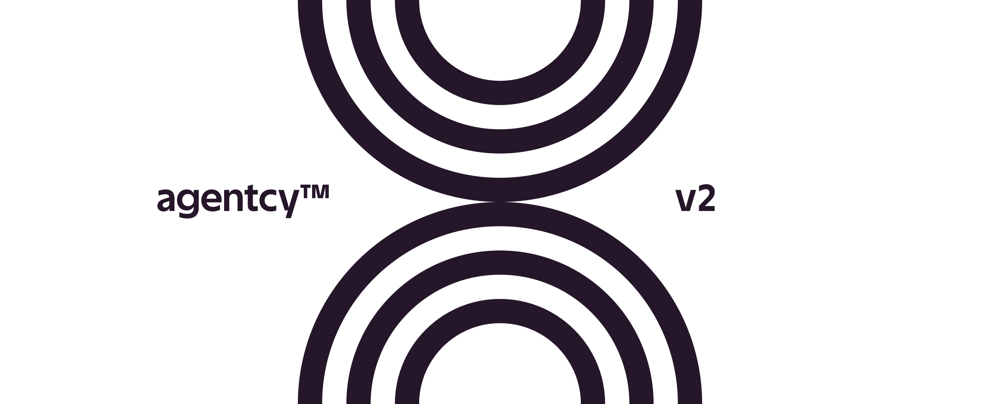
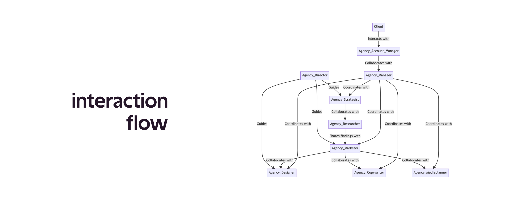

# Agentcy: Multi-Agent Collaboration with AutoGen

<p align="center">
  
</p>

This code demonstrates the power of multi-agent collaboration using the [AutoGen library](https://github.com/microsoft/autogen). Instead of relying on a single agent to handle tasks, multiple specialized agents work together, each bringing its expertise to the table.


## 📖 Overview

The code sets up a collaborative environment where multiple agents, each with its unique role and expertise, come together to discuss, plan, and execute tasks. This collaboration ensures that different aspects of a task are handled by the most qualified agent, leading to more efficient and accurate outcomes.

## 🕵🏽 Agents

The agents involved in the collaboration include:

1. **Agency Researcher**: Conducts research on user pain points, market opportunities, and prevailing market conditions.
2. **Writing Assistant**: Utilizes research and content writing functions to generate content.
3. **Agency Strategist**: Drafts strategic briefs for effective brand positioning in the market.
4. **Agency Copywriter**: Crafts compelling narratives and messages that align with the brand's strategy.
5. **Agency Media Planner**: Identifies the best mix of media channels for advertising.
6. **Agency Marketer**: Transforms strategy and insights into marketable ideas.
7. **Agency Manager**: Oversees the entire project lifecycle.
8. **Agency Director**: Guides the creative vision of the project.
9. **User Proxy**: Acts as an intermediary between the human user and the agents.

(Note: Some agents from the original list like Designer and Account Manager were commented out in the provided code updates.)

## 🤝 Collaboration Flow

1. The `GroupChat` class establishes a collaborative environment for agent communication.
2. The `GroupChatManager` oversees group chat, ensuring smooth agent interaction.
3. The `initiate_chat` method kickstarts the collaboration process. 

<p align="center">
  
</p>

## ⚙️ Setup & Configuration

1. Ensure required libraries are installed:
```
pip install pyautogen
```

2. Set up the OpenAI configuration list by either providing an environment variable `OAI_CONFIG_LIST` or specifying a file path.
```
[
    {
        "model": "gpt-3.5-turbo", #or whatever model you prefer
        "api_key": "INSERT_HERE"
    }
]
```

3. Setup api keys in .env:
```
OPENAI_API_KEY="XXX"
SERPAPI_API_KEY="XXX"
SERPER_API_KEY="XXX"
BROWSERLESS_API_KEY="XXX"
```

4. Launch in CLI:
```
python3 main.py
```

## ⏯️ Conclusion

This multi-agent collaboration approach allows for more comprehensive and efficient task handling. By leveraging the expertise of multiple agents, we can ensure that every aspect of a task is addressed by the most qualified entity. Whether it's planning a trip, as demonstrated in this example, or any other task, this collaborative approach can be adapted to fit various scenarios.

## 📈 Roadmap

1. Refine workflow and data pass through to agents
2. Reduce unnecessaery back and forth
3. Save files to local folder
4. Implement other agents, see commented out agents

## 📝 License 

MIT License. See [LICENSE](https://opensource.org/license/mit/) for more information.